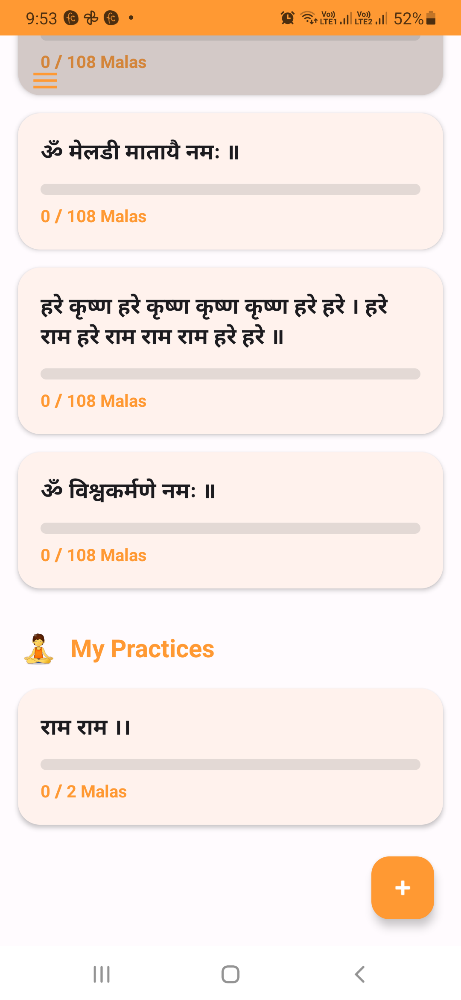
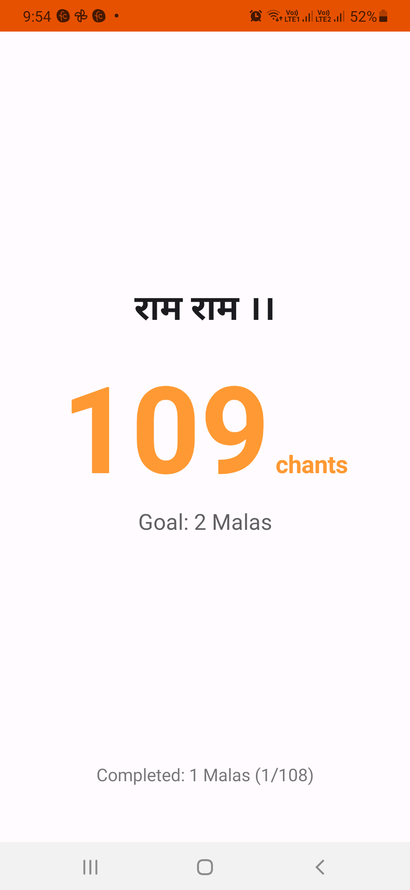
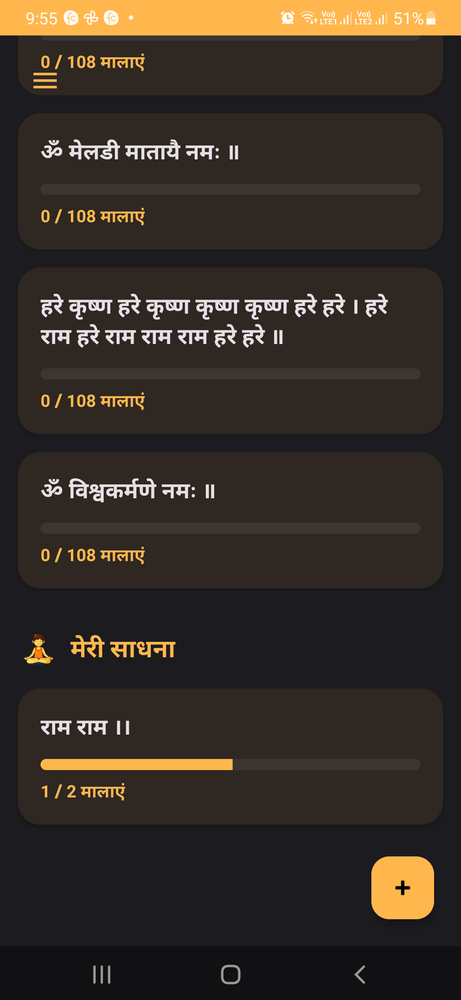
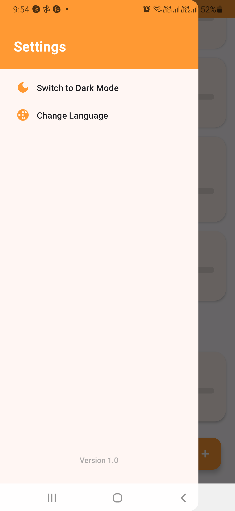
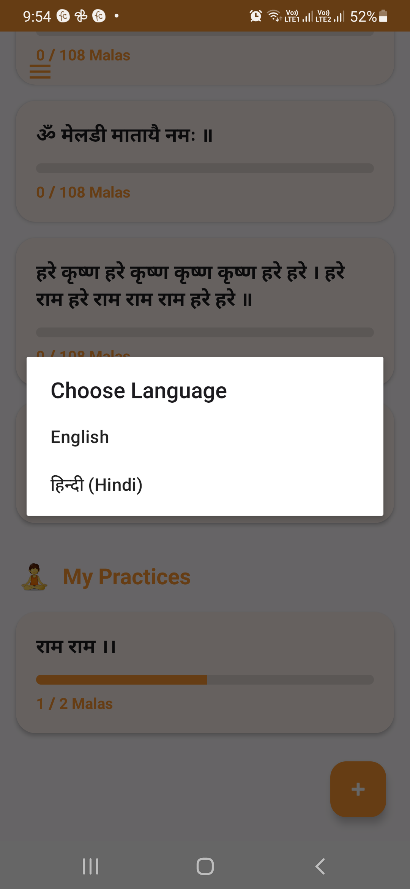

# Vedic Mantra Jap 🕉️

A native Android app for daily mantra chanting and mala tracking — built offline-first, designed for simplicity, and compliant with modern Android 15/16 standards.

[](https://play.google.com/store/apps/details?id=com.vedicapps.mantrajap)

---

## Screenshots

| Splash | Home (Light) | Chanting | Home (Dark) | Swipe Gesture | Language |
|--------|-------------|----------|-------------|---------------|----------|
|  |  |  |  |  |  |

---

## Features

- **Mantra List with Mala Tracking** — Preloaded system mantras synced from the cloud, plus user-created custom mantras with individual mala goals and progress tracking
- **Chanting Counter** — Distraction-free full-screen chanting view with live count and mala progress
- **Offline-First** — All data stored locally; app works fully without internet
- **Swipe Gestures** — Swipe to edit or delete custom mantras with canvas-drawn action backgrounds
- **Dark / Light Mode** — Switchable themes with a dedicated settings panel
- **Hindi / English** — On-the-fly language switching without restarting the app
- **Force Update** — Remote Config-driven update enforcement without a new release

---

## Tech Stack

| Area | Technology |
|------|-----------|
| Language | Kotlin |
| UI | XML (ConstraintLayout, DrawerLayout) |
| Architecture | MVVM, Offline-First |
| Local Storage | Room Database + KSP |
| Cloud Sync | Firebase Realtime Database |
| Remote Control | Firebase Remote Config |
| Async | Kotlin Coroutines |
| Build | Gradle (Kotlin DSL), Version Catalogs |
| Min SDK | API 24 (Android 7.0) |
| Target SDK | API 36 (Android 16) |

---

## Setup

```bash
git clone https://github.com/Hiren125/vedic-mantra-jap.git
```

1. Open in Android Studio
2. Add your own `google-services.json` from Firebase Console into the `app/` folder
3. Sync Gradle and run

> `google-services.json` is excluded from this repo via `.gitignore`

---

## Download

[](https://play.google.com/store/apps/details?id=com.vedicapps.mantrajap)
